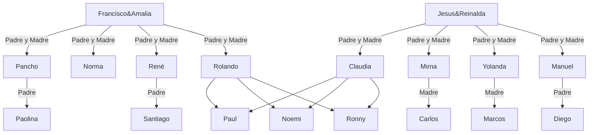

Ejercicio 1</br>


  [Ejecución](https://asciinema.org/a/8juoUgC6jJHvh1T1EKsc65Vz5)</br>
  [Depuración](https://asciinema.org/a/FHkp1TYPuWZJ6KUwMR4Tm8n5l)</br>



```bash

graph TD;

    %% Relaciones de padre e hijo
    Rolando --> Ronny;
    Rolando --> Noemi;
    Rolando --> Paul;
    Claudia --> Ronny;
    Claudia --> Noemi;
    Claudia --> Paul;

    %% Relaciones de abuelo
    Francisco&Amalia -- Padre y Madre --> Rolando;
    

    %% Relaciones familiares maternas (Tios)
    Jesus&Reinalda-- Padre y Madre --> Manuel;
    Jesus&Reinalda-- Padre y Madre --> Yolanda;
    Jesus&Reinalda-- Padre y Madre --> Mirna;
    Jesus&Reinalda-- Padre y Madre --> Claudia; 


    %% Relaciones familiares paternas (Tios)
    Francisco&Amalia -- Padre y Madre --> René;
    Francisco&Amalia-- Padre y Madre --> Norma;
    Francisco&Amalia-- Padre y Madre --> Pancho;

    %%Primos
    Manuel --Padre--> Diego;
    Yolanda --Madre--> Marcos;
    Mirna --Madre--> Carlos;
    René --Padre--> Santiago;
    Pancho --Padre--> Paolina;
  
```
